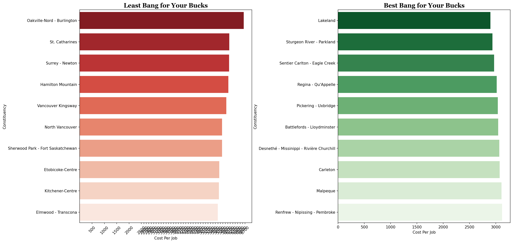
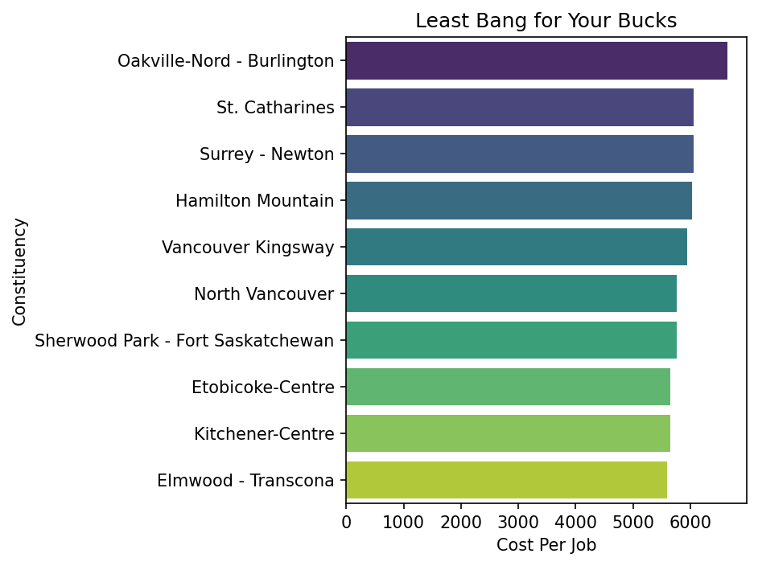
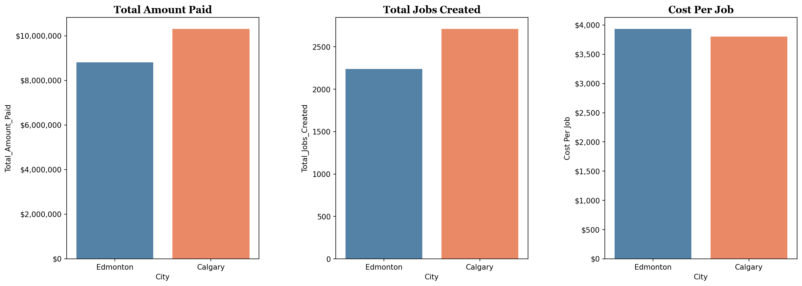
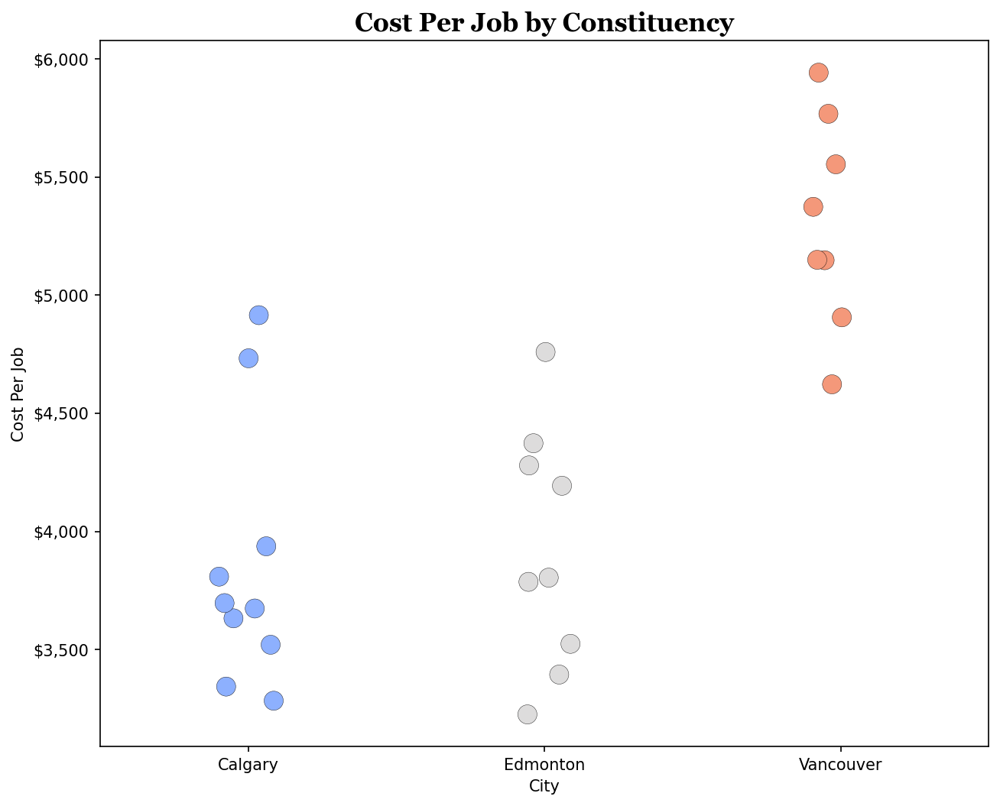

# Canada Summer Jobs (CSJ) 2024 — Findings Summary

### Key Takeaways
1. **Calgary is the most cost-efficient** of the four cities — $3,803 per job, well below the national average
2. **Vancouver is the least cost-efficient** — $5,291 per job, 28% above the national average
3. **Edmonton and Calgary** both beat the national average, with Calgary edging ahead
4. **Toronto** falls in the middle, slightly above the national average
5. The **national spread** ranges from ~$2,898 to ~$6,646 — a **$3,748 gap** between most and least efficient constituencies

## Dataset Overview

| Metric | Value |
|--------|-------|
| **Total Constituencies** | 338 |
| **Total Amount Paid** | $293,372,944 |
| **Total Jobs Created** | 71,204 |
| **National Avg Cost Per Job** | $4,120.18 |

## Top 10 Most & Least Expensive Constituencies

### Side-by-Side Comparison

The side-by-side chart below highlights the **least cost-efficient** (left, red) and **most cost-efficient** (right, green) constituencies by cost per job.

### Least Cost-Efficient (Highest Cost Per Job)

| Rank | Constituency | Cost Per Job |
|------|-------------|-------------|
| 1 | Oakville-Nord - Burlington | **$6,646** |
| 2 | St. Catharines | **$6,061** |
| 3 | Surrey - Newton | **$6,050** |
| 4 | Hamilton Mountain | **$6,023** |
| 5 | Vancouver Kingsway | **$5,942** |
| 6 | North Vancouver | **$5,768** |
| 7 | Sherwood Park - Fort Saskatchewan | **$5,765** |
| 8 | Etobicoke-Centre | **$5,657** |
| 9 | Kitchener-Centre | **$5,644** |
| 10 | Elmwood - Transcona | **$5,599** |

### Most Cost-Efficient (Lowest Cost Per Job)

| Rank | Constituency | Cost Per Job |
|------|-------------|-------------|
| 1 | Lakeland | **$2,898** |
| 2 | Sturgeon River - Parkland | **$2,935** |
| 3 | Sentier Carlton - Eagle Creek | **$2,968** |
| 4 | Regina - Qu'Appelle | **$3,015** |
| 5 | Pickering - Uxbridge | **$3,039** |
| 6 | Battlefords - Lloydminster | **$3,045** |
| 7 | Desnethé - Missinippi - Rivière Churchill | **$3,067** |
| 8 | Carleton | **$3,074** |
| 9 | Malpeque | **$3,108** |
| 10 | Renfrew - Nipissing - Pembroke | **$3,119** |

---

## Edmonton vs Calgary Comparison

A direct comparison of the two largest Alberta cities across total funding, jobs created, and cost efficiency.

### Edmonton

| Metric | Value |
|--------|-------|
| **Constituencies** | 9 |
| **Total Paid** | $8,804,926 |
| **Total Jobs** | 2,239 |
| **Avg Cost Per Job** | $3,932.53 |
| **Min / Max CPJ** | $3,225 — $4,759 |

### Calgary

| Metric | Value |
|--------|-------|
| **Constituencies** | 10 |
| **Total Paid** | $10,309,459 |
| **Total Jobs** | 2,711 |
| **Avg Cost Per Job** | $3,802.83 |
| **Min / Max CPJ** | $3,283 — $4,915 |

> 📊 **Takeaway:** Calgary spent more overall ($10.3M vs $8.8M) and created more jobs (2,711 vs 2,239), but at a **lower cost per job** ($3,803 vs $3,933) — about $130 cheaper per job.
---
## City Scatterplot — Calgary vs Vancouver vs Edmonton

Each dot represents a single constituency. The vertical position shows its cost per job, making it easy to spot patterns and outliers within each city.

> 🔵 Calgary clusters at the bottom ($3,200–$4,900), 🔴 Vancouver clusters at the top ($4,600–$5,900), and ⚪ Edmonton sits in between ($3,200–$4,700).

---

## City Comparison at a Glance

| City | Constituencies | Total Paid | Total Jobs | Cost Per Job |
|------|---------------|------------|------------|-------------|
| Calgary | 10 | $10,309,459 | 2,711 | **$3,802.83** 🟢 |
| Edmonton | 9 | $8,804,926 | 2,239 | **$3,932.53** |
| Toronto | 3 | $2,915,847 | 638 | **$4,570.29** |
| Vancouver | 8 | $5,979,087 | 1,130 | **$5,291.23** 🔴 |
| *National Avg* | *338* | *$293,372,944* | *71,204* | *$4,120.18* |

---

*Analysis based on Canada Summer Jobs 2024 results data (`csj-results-cleaned.csv`)*
